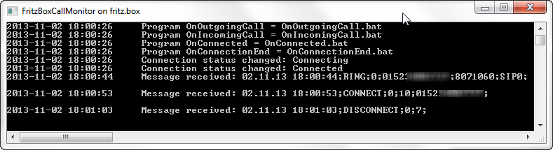
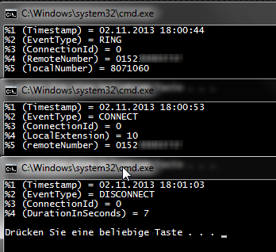

FritzBoxCallMonitor
===================

Simple and lightweight console client for FritzBox's integrated CallMonitor. It executes a specified program on call-events, any available information will be appended to it as a parameter.

> ### Download latest release: [FritzBoxCallMonitor v1.1.0.0](https://github.com/berrnd/FritzBoxCallMonitor/releases/latest) ###

## Quick start ##
> Note: If you haven't yet, you first need to enable the CallMonitor in your FritzBox by "calling" `#96*5*` from any connected phone.

Just download, unpack anywhere and execute `Start.bat` from the `Examples` directory.

This will open up a connection to `fritz.box` (the default hostname, will work if you use your FritzBox as a DNS) and executes a "echo batch script", which will show you any passed parameter, on every event.

## Parameters ##
FritzBoxCallMonitor knows the following parameters, all of them are optional:

* `FritzBox=<FritzBoxHostnameOrIp>`
  * The Hostname or IP of your FritzBox (default is `fritz.box`)
* `OnIncomingCall=<PathToAnything>`
  * The program which will be executed on an incoming call, the following parameters will be appended:
  * `Timestamp`
  * `RING` (a word, indicates the event type)
  * `ConnectionId` (a number, use this to group events to calls)
  * `RemoteNumber` (the calling number)
  * `LocalNumber` (the called number)
* `OnOutgoingCall=<PathToAnything>`
  * The program which will be executed on an outgoing call, the following parameters will be appended:
  * `Timestamp`
  * `CALL` (a word, indicates the event type)
  * `ConnectionId` (a number, use this to group events to calls)
  * `LocalExtension` (the internal number of the used phone)
  * `LocalNumber` (the external used number)
  * `RemoteNumber` (the called number)
* `OnConnected=<PathToAnything>`
  * The program which will be executed when connection is established, the following parameters will be appended:
  * `Timestamp`
  * `CONNECT` (a word, indicates the event type)
  * `ConnectionId` (a number, use this to group events to calls)
  * `LocalExtension` (the internal number of the used phone)
  * `RemoteNumber` (the called or calling number)
* `OnConnectionEnd=<PathToAnything>`
  * The program which will be executed when a connection is closed, the following parameters will be appended:
  * `Timestamp`
  * `DISCONNECT` (a word, indicates the event type)
  * `ConnectionId` (a number, use this to group events to calls)
  * `DurationInSeconds` (a number, the duration of the connection in seconds)

Or simply look into `Start.bat` in the `Examples` directory for an example call.

## Screenshots ##

## License ##
The MIT License (MIT)
